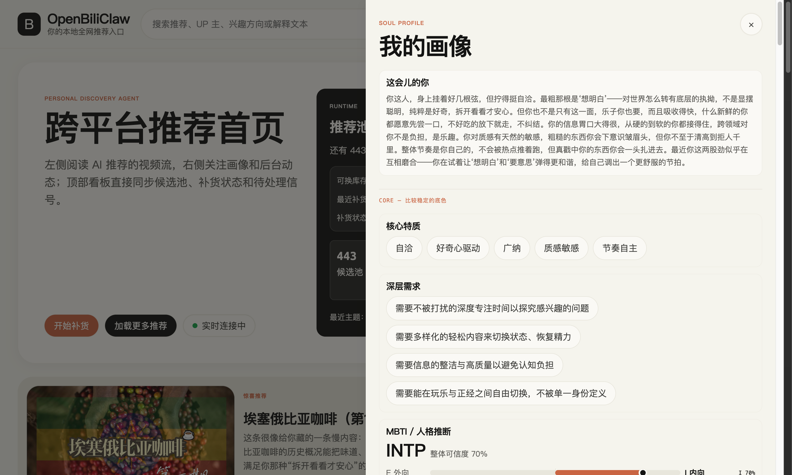
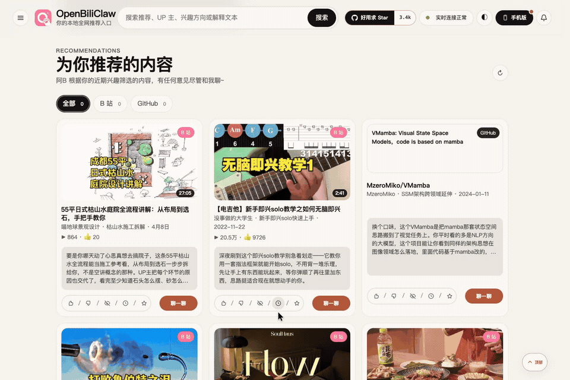
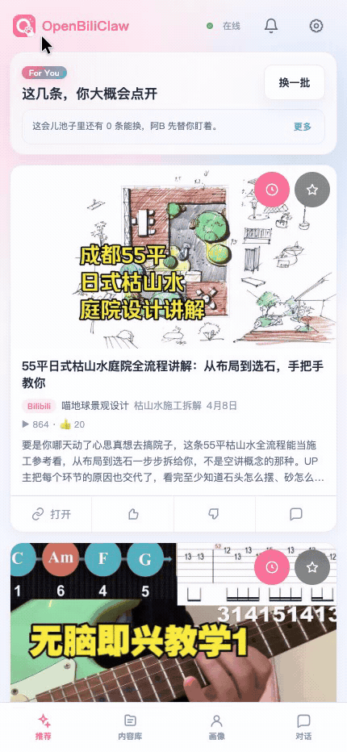
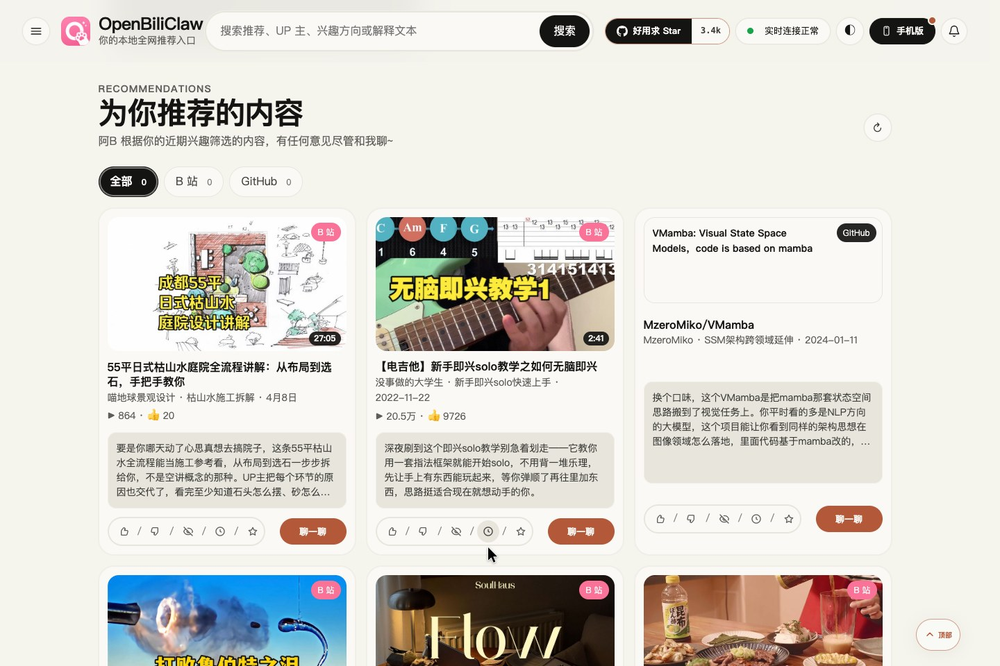
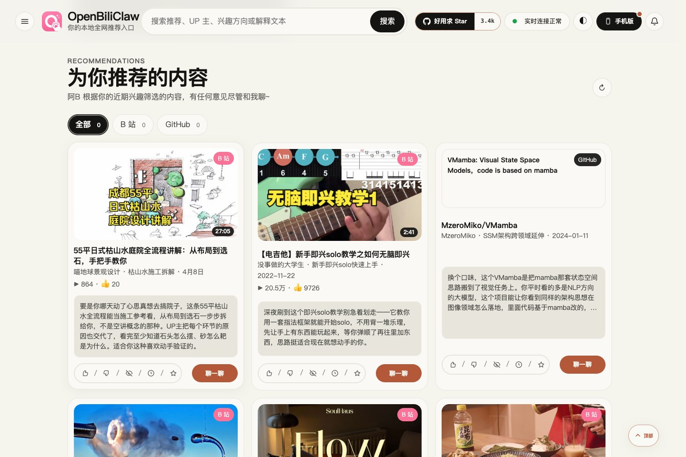
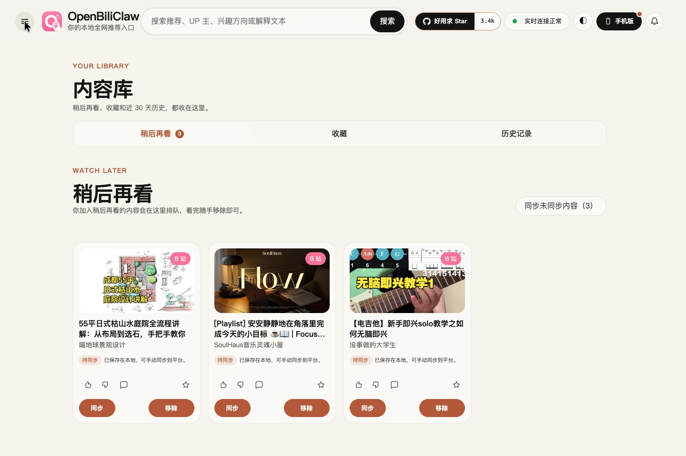
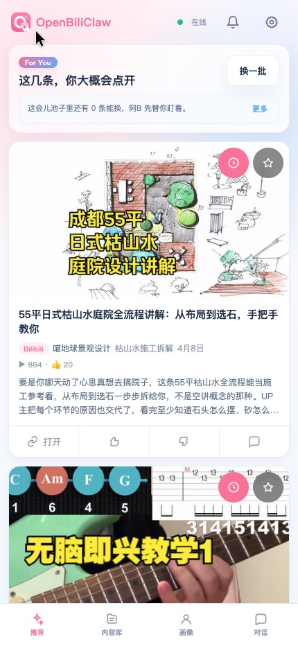
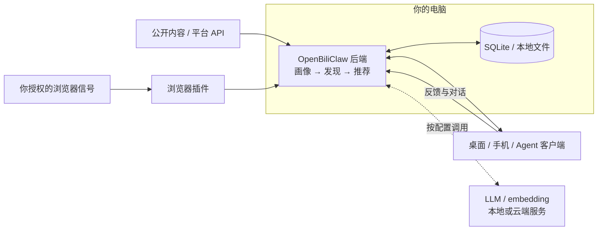
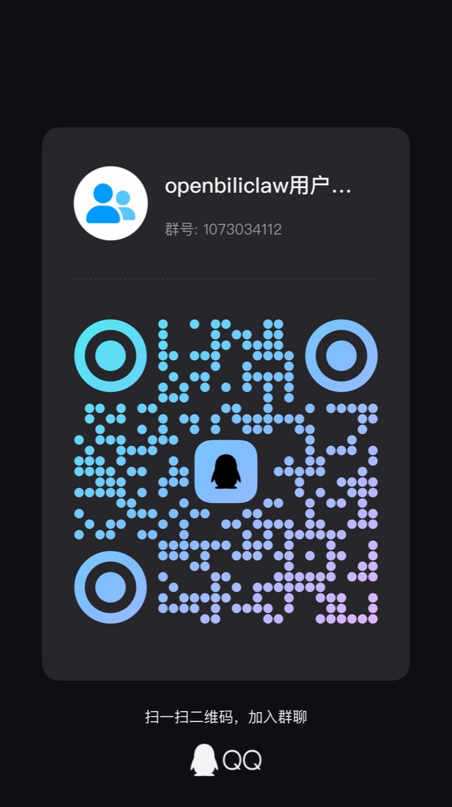

# 🦀 OpenBiliClaw

**少刷重复的推荐，多发现合你口味的内容。**

一个能听你讲偏好、记住你的兴趣、替你跨平台找内容的 **AI 内容朋友**。 
在你的电脑上运行，把可查看、可纠正的个人画像用到发现和推荐中。

[**为什么用它**](#为什么做-openbiliclaw) · [**它有什么不同**](#它有什么不同) · [**产品预览**](#产品预览) · [**开始使用**](#快速开始) · [项目官网](https://whiteguo233.github.io/OpenBiliClaw/) · [English](README_EN.md)

## 为什么做 OpenBiliClaw？

打开了几个 App，刷过很多条内容，最后却没有找到真正想看的东西。想学点新东西时，又得自己想关键词、换平台搜，再逐条判断质量。

OpenBiliClaw 想把这部分寻找和筛选交给一个长期了解你、也能被你纠正的 Agent：

| 你可能遇到的问题 | 在 OpenBiliClaw 里怎么处理 |
|---|---|
| **刷了很多，还得自己筛。** 标题看着相关，点进去才发现讲法、深度不合适。 | 把兴趣、内容风格和避雷偏好用于候选评估，推荐时附上与你的关联理由，帮你决定值不值得打开。 |
| **兴趣散在几个平台。** 在 B 站学原理，在小红书找经验，在 GitHub 找项目，每次都要重新找。 | 让已连接来源的信号进入同一份画像，再用它跨平台发现视频、文章、帖子和公开项目。 |
| **想看点新的，却不知道该搜什么。** 熟悉的话题反复出现，陌生的好内容又搜不到。 | 从画像生成搜索方向，结合关联内容和跨领域探索寻找候选；你可以确认或否定新兴趣。 |
| **被理解错了，却说不清怎么改。** 临时点开一个话题，并不代表想一直看。 | 查看、编辑画像，说明具体偏好；用单条反馈、话题避雷或对话纠正，影响后续筛选。 |

## 它有什么不同？

### 1. 它对你的理解，可以摊开来看，也可以改

从你授权的历史、收藏、关注等来源信号起步，逐步形成包含**兴趣层次、内容风格、避雷项和近期状态**的画像。你能看到它如何理解你，也能直接修改判断或通过对话补充背景。

**手动修正会独立保存，后续 AI 重建画像时仍然保留。** 你删掉的特质，也不会因为模型再次推断到它就直接回来。

这份理解会参与后续搜索方向、候选评估和推荐表达。比如同样是“喜欢吉他”，**想跟练、喜欢系统讲解、暂时不想看器材测评**，是值得继续区分的偏好。

  
   
  仓库既有画像截图，界面版本与下方本次操作实录不同。画像是可纠正的模型推断。

### 2. 带着你的口味，主动去不同平台找

后端运行时，会按配置持续搜索、跟进关联内容并探索新方向，再把候选放到同一套个人偏好下评估。你可以选择内容来源、调整平台比例，也可以在熟悉的兴趣之外确认新的探索方向。

探索会从相近领域走向跨领域联想。系统提出的新兴趣，你可以选择**确认喜欢、确认不喜欢、暂时搁置或继续聊聊**，逐步决定它该往哪里找。

**你不必先知道某个作者、项目或精确关键词，才有机会遇见它。** B 站、小红书、YouTube、GitHub 等来源各自负责提供不同类型的内容；发现、登录和初始化能力的区别见[来源说明](#支持的内容来源与客户端)。

这些控制作用于 OpenBiliClaw 自己的推荐入口，不会修改各平台原生首页的推荐算法。

### 3. 推荐带着理由，反馈能说得更具体

每条推荐会说明它与你的兴趣有什么关系。看着不对，可以点「不感兴趣」，也可以从内容继续聊：是话题不喜欢、讲法不合适，还是当前不想看？对话中的偏好会经过分析，部分推断会请你确认；明确的画像修改和避雷项用于后续筛选。

单条反馈与长期偏好分开处理，新确认兴趣还有占比保护和多样性约束，减少一个方向短期占满推荐的情况。**学习和内容发现需要时间，提交反馈不代表下一屏一定立刻改变。**

### 4. 这份长期积累，由你掌握

画像、推荐、对话和收藏默认保存在自己的后端。模型服务、采集来源和推荐入口由你选择；桌面、手机与插件共享同一套后端，还可通过 [Agent Bridge](docs/agent-integration.md) 在现有 AI 助手中访问推荐和画像。

自托管的价值是能决定系统了解什么、如何改、用哪个模型，并保留持续积累的资料。使用云端模型时，必要内容仍会发送给所选服务商，详见[隐私速览](#隐私速览)。

## 放到日常里，它可以怎么用？

下面是**使用场景与偏好表达示例**，用于说明如何使用已有能力；不代表实录中的输入、生成结果或效果承诺。

### 认真培养一个爱好

> “最近在学吉他，想看能跟练的基础课，偏好讲得慢、讲得清楚的内容，先别推器材测评。”

通过对话和画像编辑保留学习方向、风格与避雷偏好，供后续发现和评估使用。

### 围绕一个方向跨平台探索

> “我在了解本地 AI 工具，既想看原理讲解，也想找到能动手试的开源项目。”

在你启用的来源里发现不同内容类型，统一呈现推荐理由；选中有用的内容放进稍后再看。

### 让推荐跟上兴趣变化

> “最近不想看游戏实况了，想多接触摄影，喜欢讲构图思路的内容。”

调整画像中的兴趣和避雷项，结合后续反馈逐步校准；新方向不必靠反复点击来表达。

**最适合这样的你：** 经常跨平台找内容，有自己的口味，希望推荐能被解释和纠正，也愿意配置模型、让后端持续运行。首次初始化需要等待，云端模型可能产生费用；推荐质量仍受模型、来源可用性和已有信号影响。

> 项目从 B 站起步，因此保留了 Bili 这个名字。现在它面向多个内容平台，由你选择模型服务和内容来源。

## 产品预览

从一条已有推荐开始：**展开理由 → 加入稍后再看 → 在内容库确认保存**。

  

[**观看完整实录（25 秒，中英字幕）**](https://whiteguo233.github.io/OpenBiliClaw/#demo) · [文字稿与素材说明](docs/media/README.md)

这段实录展示真实后端上的推荐查看与本地保存。画像学习、跨平台发现和推荐生成没有在这段视频中录制；界面原文为中文，录制范围与内容来源见素材说明。

手机端操作实录：喜欢反馈与共享内容库

在手机 Web 点「喜欢」，确认反馈提交成功，再打开同一后端的内容库，查看桌面端保存的记录。

  

[观看手机实录（约 20 秒）](https://whiteguo233.github.io/OpenBiliClaw/#mobile-demo) · [文字稿与素材说明](docs/media/README.md)

更多真实截图：推荐理由、内容库与手机 Web

**桌面推荐首页** — 同一页查看不同来源的内容与推荐理由。

  

**展开推荐理由** — 阅读一条内容为什么被推荐。

  

**内容库** — 在「稍后再看」中找到刚保存的内容。

  

**手机 Web** — 连接同一后端，在手机布局中查看推荐。

  

点开截图查看原图。手机画面来自移动端 Web，原生 Flutter 客户端见下方客户端列表。

## 快速开始

**需要准备：一台运行后端的电脑、可用的 LLM 服务、独立 embedding 服务，以及至少一个可提供画像信号的内容来源。** 默认 embedding 是本地 Ollama `bge-m3`；云端 LLM 的调用按你选择的服务计费。

1. **安装桌面后端。** 从 [Latest Release](https://github.com/whiteguo233/OpenBiliClaw/releases/latest) 下载 macOS `.dmg` 或 Windows `.exe`，安装并启动。精简版首启下载 `bge-m3`；`-with-embedding` 完整版预置约 1.1GB 的向量模型，**两者都需另行配置 LLM**。桌面包目前为实验性预发布，首次启动问题见 [安装指南](docs/installation.md#desktop)。
2. **安装浏览器插件。** 从 [Chrome 应用商店](https://chromewebstore.google.com/detail/cdfjfkdjjhdaccbldipkjhpibnfbiamg) 安装，或使用 Release 中的插件包。插件负责平台会话和浏览器内交互；Firefox、Safari 与手动加载方式见 [完整安装指南](docs/installation.md)。
3. **配置模型与来源。** 打开 `http://127.0.0.1:8420/setup/`，填写 LLM 配置并检查 embedding。在装了插件的浏览器登录 B 站，或按向导改选其他来源；只勾选你愿意用于画像初始化的来源。
4. **初始化并看推荐。** 确认连接正常后点击「开始初始化」，等待画像与首轮内容发现完成，再打开 `http://127.0.0.1:8420/web`。从一条推荐开始，读理由、给反馈，让后续推荐更贴近你。

后端需要保持运行。手机与电脑在同一局域网时，可扫描插件里的二维码，打开移动端 Web 并添加到主屏幕。

### 安装与部署详情

[完整安装指南](docs/installation.md) 收录不同系统、升级方式和排查步骤。按你的环境选择：

| 场景 | 入口 |
|---|---|
| 让 AI 助手安装、定制源码 | [AI 一句话部署](docs/installation.md#ai-deploy) |
| Linux / WSL2 / 终端安装 | [Bash / PowerShell 脚本](docs/installation.md#script-install) |
| 已有 Docker 环境 | [Docker 部署](docs/installation.md#docker) |
| 开发与调试 | [手动安装](docs/installation.md#manual) |
| 手机跨网络、远程浏览器 | [应用内 Tailnet](docs/modules/tailnet.md) · [HTTPS 部署](docs/https-deployment.md) |
| 国内下载 | [v0.3.221 历史镜像与版本说明](docs/installation.md#desktop)；当前版本以 GitHub Release 为准 |

## 支持的内容来源与客户端

默认启用 B 站，其他来源在设置中明确开启。各平台的发现、登录和初始化能力不同：

| 来源 | 你需要知道的事 |
|---|---|
| B 站 | 从历史、收藏与关注开始，支持搜索、趋势与关联探索 |
| 小红书、抖音、YouTube | 通过浏览器插件读取授权信号；YouTube 也可导入 Takeout |
| X、知乎、Reddit | 使用已登录会话和各自适配路径；内容以文字卡片呈现 |
| Linux.do、V2EX、微博 | 支持公开发现；个人初始化按来源要求连接登录浏览器 |
| Bangumi、GitHub | 可匿名发现公开内容；公开用户名可提供收藏 / Star 初始化信号 |
| 开放 Web | 通用网页提取与自定义来源，详见发现引擎文档 |

完整权限与来源差异见 [来源登录与限制](docs/installation.md#source-access) 和 [内容发现引擎](docs/modules/discovery.md)。

| 客户端 | 适合怎样使用 |
|---|---|
| 浏览器插件 | 在平台内浏览、同步会话、反馈与聊天；支持 Chromium、Firefox、macOS Safari |
| 桌面 Web `/web` | 在大屏查看推荐、画像、内容库与设置 |
| 移动 Web `/m/` | 扫码访问，添加到手机主屏幕 |
| [Flutter 客户端](https://github.com/whiteguo233/OpenBiliClaw-mobile) | Android / iOS / Web / 桌面，新特性预览版；iOS 安装需个人账号重签 |
| [DSH 插件](https://github.com/whiteguo233/dsh-openbiliclaw) | 在 DeepSeek Harness 内打开推荐面板、调用 Agent Bridge 工具 |

这些客户端连接同一个后端。手机不会代替电脑运行发现任务；账号会话同步仍由浏览器插件承担。

## 架构概览

这是核心数据流的概念图；完整模块、任务与进程关系见 [架构总览](docs/architecture-overview.md)。

## 隐私速览

画像、推荐历史、聊天与配置默认保存在本机。插件把数据发送给你配置的 OpenBiliClaw 后端，不会发送给项目开发者运营的服务器。

**本地运行不等于所有调用都离线：使用云端 LLM 或 embedding 时，必要的画像、对话或内容会按你的配置发送给相应服务商。** 需要账号态的来源也会按各自契约处理会话；例如 Linux.do 只上报登录布尔，不上传 Cookie 值。

账号周期回拉默认关闭，可在设置中按需开启。你可以选择模型和来源、关闭采集，并管理本地数据。主动导出的 `.obcbackup` 可能含 API Key、Cookie、画像与历史，且未加密，应仅在可信设备间传递。详细边界见 [隐私政策](docs/privacy.md)。

## 文档与集成

| 想了解什么 | 从这里开始 |
|---|---|
| 安装、连接、更新 | [安装指南](docs/installation.md) · [常见问题](docs/faq.md) |
| 所有文档 | [文档导航](docs/index.md) |
| 工作原理 | [架构设计](docs/architecture.md) · [记忆系统](docs/memory-design.md) |
| 推荐与画像 | [发现引擎](docs/modules/discovery.md) · [灵魂引擎](docs/modules/soul.md) |
| 参数与命令 | [配置参考](docs/modules/config.md) · [CLI 参考](docs/modules/cli.md) |
| 开发计划与贡献 | [项目规格](docs/spec.md) · [开发指南](docs/contributing.md) |

支持 OpenClaw、Hermes、WorkBuddy、Claude Code、Codex CLI、Cursor 等能够使用 workspace skill 或本地 JSON CLI 的宿主。它们可通过 [Agent Bridge](docs/agent-integration.md) 读取推荐、参与对话和提交反馈；仓库附带 [适配 Skill](skills/openbiliclaw-adapter/SKILL.md)。外部保存同步需显式授权。

原生客户端见 [OpenBiliClaw-mobile](https://github.com/whiteguo233/OpenBiliClaw-mobile)，DeepSeek Harness 集成见 [dsh-openbiliclaw](https://github.com/whiteguo233/dsh-openbiliclaw) / [DSH 插件市场](https://dshfind.com/zh/plugins)。

## 最近更新

📌 最新版本：**v0.3.224（2026-09-19）**

- **自定义 AI 回复语气**：为对话、推荐文案与画像追加语气要求，也可整体替换聊天语气。
- **设置页直接编辑与测试**：桌面 Web 和插件可保存回复语气，并立即测试真实回复，无需重启。

完整变更详见 [docs/changelog.md](docs/changelog.md)。

## 用户交流群

遇到问题可先查 [FAQ](docs/faq.md)，或提交 [Issue](https://github.com/whiteguo233/OpenBiliClaw/issues)。欢迎在 [Linux.do 讨论帖](https://linux.do/t/topic/1978894) 分享使用体验。

<table>
  <tr>
    <td align="center" width="50%">
       
      <b>QQ 用户群</b>
    </td>
    <td align="center" width="50%">
       
      <a href="https://discord.gg/PU6Xgch8yg"><b>加入 Discord</b></a>
    </td>
  </tr>
</table>

源码镜像：[Gitee](https://gitee.com/whiteguo233/OpenBiliClaw) · [AtomGit](https://atomgit.com/whiteguo233/OpenBiliClaw)。下载镜像可能滞后，版本以 GitHub Release 为准。

## 贡献与致谢

欢迎改进平台适配、推荐体验、文档与测试。开始前请阅读 [开发指南](docs/contributing.md)，并在独立 worktree 中开发和验证。

感谢这些贡献者与他们带来的改进

- 感谢 [@addtion99](https://github.com/addtion99) 在 [#8](https://github.com/whiteguo233/OpenBiliClaw/pull/8) 提出浏览器插件后端地址 / 端口可配置需求，并给出 popup 侧实现思路。
- 感谢 [@jiaobenhaimo](https://github.com/jiaobenhaimo) 在 [#53](https://github.com/whiteguo233/OpenBiliClaw/pull/53) 贡献 Safari 扩展、稍后再看、YouTube 搬运检测、营销号过滤等功能设计与实现，其中 OR-join 去重修复和稍后再看功能已合入主线。
- 感谢 [@tangle111-design](https://github.com/tangle111-design) 在 [#69](https://github.com/whiteguo233/OpenBiliClaw/pull/69) 贡献 `style_key` 观看模式、推荐语气、B 站初始化和 LLM / 画像流程方面的功能探索；相关思路已拆分评审并选择性合入主线。
- 感谢 [@DongLanQwQ0](https://github.com/DongLanQwQ0) 在 [#102](https://github.com/whiteguo233/OpenBiliClaw/pull/102) 贡献桌面 Web 侧栏折叠动画、delight 卡片拖拽死区、栈式 toast 通知等交互细节打磨，已合入主线。
- 感谢 [@DongLanQwQ0](https://github.com/DongLanQwQ0) 在 [#110](https://github.com/whiteguo233/OpenBiliClaw/pull/110) 贡献桌面 Web 主题引擎 oklch 化重构，引入 `--hue-primary` 单一控制点与 12 色相可调拾色器、五级强调色阶与统一交互态，已合入主线。
- 感谢 [@wuwafly3](https://github.com/wuwafly3) 持续贡献多模态推荐能力：在 [#100](https://github.com/whiteguo233/OpenBiliClaw/pull/100) 中实现 DashScope（阿里百炼）多模态 embedding provider 与封面 image-only 向量，并在 [#135](https://github.com/whiteguo233/OpenBiliClaw/pull/135) 中进一步实现用户视觉画像（P1）、B 站弹幕语义（P2）、视频关键帧（P3）及跨平台视觉加权管线；主干在这些实现上完成契约加固、失败重试、配置界面与真实环境验收。
- 感谢 [@LHMQ878](https://github.com/LHMQ878) 在 [#182](https://github.com/whiteguo233/OpenBiliClaw/pull/182) 修复 `agent_bootstrap` 对引号键 TOML 实例段（如 `[llm.instances."openai"]`）的 section 匹配，避免二次运行 bootstrap 时重复声明表导致 `tomllib` 解析失败，已合入主线。
- 感谢 [@Patrick5D](https://github.com/Patrick5D) 在 [#179](https://github.com/whiteguo233/OpenBiliClaw/pull/179) 贡献事件来源归属持久化（`events.source_platform` / `content_id` / `source_confidence`、统一来源解析优先级与 schema v6 增量迁移），为按平台撤回数据重建画像奠定数据基础；主干在此之上完成未知平台 slug 降级与 confidence 防升级加固，已合入主线。
- 感谢 [@OctoBored](https://github.com/OctoBored) 在 [#196](https://github.com/whiteguo233/OpenBiliClaw/pull/196) 恢复 README 中/英文的实时 Star History 图表，替换已失效的静态徽章与临时提示；主干在合入时补齐了 URL 中的 `&amp;` 转义，已合入主线。

## License

[MIT](LICENSE)
