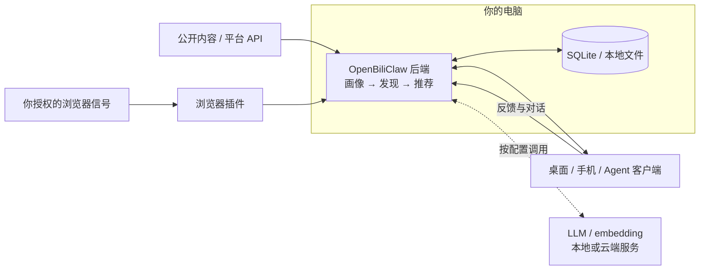

# 🦀 OpenBiliClaw

**通用个性化内容推荐 Agent——本地运行、跨平台理解你、只为你一个人构建**

从你的跨平台使用、反馈和对话中持续深化画像，带着对你的理解，主动寻找你会喜欢、也可能从未想到的内容。

[**看产品演示**](#产品预览) · [**开始使用**](#快速开始) · [**为什么需要它**](#为什么需要-openbiliclaw) · [项目官网](https://whiteguo233.github.io/OpenBiliClaw/) · [English](README_EN.md)

## 产品预览

**先看它怎么用：刷跨平台推荐 → 看理由、给反馈 → 在插件和手机继续看 → 了解画像、兴趣探索与对话。**

  

[**观看完整产品导览（70 秒，中英字幕）**](https://whiteguo233.github.io/OpenBiliClaw/#demo) · [文字稿与素材说明](docs/media/README.md)

上方 GIF 用 20 秒预览八个章节；完整导览由**真实操作录屏与仓库已公开的功能截图**编排而成，带有逐段介绍。桌面、插件和手机的查看、保存与反馈使用真实本地后端；画像与对话部分展示已有界面，不代表在这段视频内完成了画像学习或推荐生成。

### 桌面、浏览器插件、手机，随时刷一刷

**桌面 Web：** 在大屏浏览跨平台内容，展开推荐理由，点「喜欢」「不感兴趣」，或保存到内容库、从某条内容继续聊。

  

[桌面完整实录：展开理由 → 稍后再看 → 内容库确认（25 秒）](docs/media/recommendation-walkthrough.mp4)

<table>
  <tr>
    <td align="center" width="50%" valign="top">
       
      <b>浏览器插件</b> 
      在浏览器里打开推荐面板，反馈、收藏、对话；连接已授权的平台会话。 
      <a href="docs/media/extension-walkthrough.mp4">插件实录：刷跨平台推荐 → 内容库（18 秒）</a>
    </td>
    <td align="center" width="50%" valign="top">
       
      <b>手机 Web</b> 
      扫码连接同一后端，随手刷推荐、给反馈，继续看桌面保存的内容。 
      <a href="https://whiteguo233.github.io/OpenBiliClaw/#mobile-demo">手机实录：喜欢反馈与共享内容库（约 20 秒）</a>
    </td>
  </tr>
</table>

插件录屏将真实扩展页面独立打开，便于看清操作；手机截图来自移动端 Web。另有 [Flutter 原生客户端](https://github.com/whiteguo233/OpenBiliClaw-mobile)与 [DeepSeek Harness 插件](https://github.com/whiteguo233/dsh-openbiliclaw)，都连接同一套后端；客户端能力见[下方说明](#支持的内容来源与客户端)。

### 看它怎样理解你，也和它聊一聊

推荐之外，你可以看到 Agent 对你的长期理解、内容口味与新兴趣猜测，也能从推荐内容发起对话。点图可查看原图。

<table>
  <tr>
    <td align="center" width="50%" valign="top">
       
      <b>灵魂画像</b> 
      看看它如何理解你的兴趣、特质与深层需求，也可以纠正这些判断。
    </td>
    <td align="center" width="50%" valign="top">
       
      <b>认知风格与内容口味</b> 
      关注喜欢什么，也关注适合怎样的讲法、深度和表达；另有长期价值偏好。
    </td>
  </tr>
  <tr>
    <td align="center" width="50%" valign="top">
       
      <b>兴趣探针</b> 
      主动提出你可能喜欢的新方向，听听理由，再确认、否定或继续聊。
    </td>
    <td align="center" width="50%" valign="top">
       
      <b>围绕内容继续聊</b> 
      说说哪里有趣、为什么不喜欢，或聊一个新话题，让理解在对话中继续深化。
    </td>
  </tr>
</table>

这组为仓库既有功能截图，界面版本与上方实录有所不同。画像是模型推断；手动修正会保留，后续 AI 重建不会直接覆盖。更多界面：[桌面画像](docs/images/desktop-profile.png) · [价值偏好与兴趣](docs/images/screenshot-profile-values.png) · [真实内容库](docs/images/live-desktop-library.jpg)。

## 快速开始

**需要准备：一台运行后端的电脑、可用的 LLM 服务、独立 embedding 服务，以及至少一个可提供画像信号的内容来源。** 默认 embedding 是本地 Ollama `bge-m3`；云端 LLM 的调用按你选择的服务计费。

1. **安装桌面后端。** 从 [Latest Release](https://github.com/whiteguo233/OpenBiliClaw/releases/latest) 下载 macOS `.dmg` 或 Windows `.exe`，安装并启动。精简版首启下载 `bge-m3`；`-with-embedding` 完整版预置约 1.1GB 的向量模型，**两者都需另行配置 LLM**。桌面包目前为实验性预发布，首次启动问题见 [安装指南](docs/installation.md#desktop)。
2. **安装浏览器插件。** 从 [Chrome 应用商店](https://chromewebstore.google.com/detail/cdfjfkdjjhdaccbldipkjhpibnfbiamg) 安装，或使用 Release 中的插件包。插件负责平台会话和浏览器内交互；Firefox、Safari 与手动加载方式见 [完整安装指南](docs/installation.md)。
3. **配置模型与来源。** 打开 `http://127.0.0.1:8420/setup/`，填写 LLM 配置并检查 embedding。在装了插件的浏览器登录 B 站，或按向导改选其他来源；只勾选你愿意用于画像初始化的来源。
4. **初始化并看推荐。** 确认连接正常后点击「开始初始化」，等待画像与首轮内容发现完成，再打开 `http://127.0.0.1:8420/web`。从一条推荐开始，读理由、给反馈，让后续推荐更贴近你。

后端需要保持运行。手机与电脑在同一局域网时，可扫描插件里的二维码，打开移动端 Web 并添加到主屏幕。

### 安装与部署详情

[完整安装指南](docs/installation.md) 收录不同系统、升级方式和排查步骤。按你的环境选择：

| 场景 | 入口 |
|---|---|
| 让 AI 助手安装、定制源码 | [AI 一句话部署](docs/installation.md#ai-deploy) |
| Linux / WSL2 / 终端安装 | [Bash / PowerShell 脚本](docs/installation.md#script-install) |
| 已有 Docker 环境 | [Docker 部署](docs/installation.md#docker) |
| 开发与调试 | [手动安装](docs/installation.md#manual) |
| 手机跨网络、远程浏览器 | [应用内 Tailnet](docs/modules/tailnet.md) · [HTTPS 部署](docs/https-deployment.md) |
| 国内下载 | [v0.3.221 历史镜像与版本说明](docs/installation.md#desktop)；当前版本以 GitHub Release 为准 |

## 为什么需要 OpenBiliClaw？

推荐系统连接内容与用户，也同时服务平台的留存、创作者生态、商业收入等目标。**这些目标如何权衡，通常由平台决定。** 而你的兴趣又散在不同平台，没有一个推荐入口能从你自己的完整视角出发。

OpenBiliClaw 想让推荐系统重新站到用户这一边：**先理解你，再带着这份理解主动找内容；这个 Agent 只为你一个人构建。**

- **先懂你，再找内容。** 从授权的使用行为、反馈与对话中，逐步形成兴趣、认知风格、价值偏好与深层需求的理解。五层记忆将事件、偏好、觉察、洞察和灵魂画像连接起来；画像是可以查看、纠正的模型推断。
- **主动探索你还没想到的兴趣。** 根据已有理解提出跨领域联想，再让真实内容与反馈验证。例如从机械表联想到建筑美学、从量子物理联想到哲学，是这类探索的方向示意。新兴趣可以确认、否定或搁置。
- **在持续使用中进化。** 使用与反馈进入记忆，记忆深化画像，画像指导发现，推荐与对话带来新的理解。后端运行时，这个闭环按配置持续推进；学习与内容发现需要时间。
- **跨平台寻找，积累归你。** 将多个来源的信号用于同一份画像，从不同平台寻找内容。画像、推荐、对话和收藏默认保存在自己的后端；模型与来源由你选择，数据可以迁移，代码可以定制。云端模型调用的边界见[隐私速览](#隐私速览)。

> 项目从 B 站起步，因此保留了 Bili 这个名字；现在它面向多个内容平台。这些能力作用于 OpenBiliClaw 的推荐入口，不会修改各平台原生首页的算法。

## 支持的内容来源与客户端

默认启用 B 站，其他来源在设置中明确开启。各平台的发现、登录和初始化能力不同：

| 来源 | 你需要知道的事 |
|---|---|
| B 站 | 从历史、收藏与关注开始，支持搜索、趋势与关联探索 |
| 小红书、抖音、YouTube | 通过浏览器插件读取授权信号；YouTube 也可导入 Takeout |
| X、知乎、Reddit | 使用已登录会话和各自适配路径；内容以文字卡片呈现 |
| Linux.do、V2EX、微博 | 支持公开发现；个人初始化按来源要求连接登录浏览器 |
| Bangumi、GitHub | 可匿名发现公开内容；公开用户名可提供收藏 / Star 初始化信号 |
| 开放 Web | 通用网页提取与自定义来源，详见发现引擎文档 |

完整权限与来源差异见 [来源登录与限制](docs/installation.md#source-access) 和 [内容发现引擎](docs/modules/discovery.md)。

| 客户端 | 适合怎样使用 |
|---|---|
| 浏览器插件 | 在平台内浏览、同步会话、反馈与聊天；支持 Chromium、Firefox、macOS Safari |
| 桌面 Web `/web` | 在大屏查看推荐、画像、内容库与设置 |
| 移动 Web `/m/` | 扫码访问，添加到手机主屏幕 |
| [Flutter 客户端](https://github.com/whiteguo233/OpenBiliClaw-mobile) | Android / iOS / Web / 桌面，新特性预览版；iOS 安装需个人账号重签 |
| [DSH 插件](https://github.com/whiteguo233/dsh-openbiliclaw) | 在 DeepSeek Harness 内打开推荐面板、调用 Agent Bridge 工具 |

这些客户端连接同一个后端。手机不会代替电脑运行发现任务；账号会话同步仍由浏览器插件承担。

## 架构概览

这是核心数据流的概念图；完整模块、任务与进程关系见 [架构总览](docs/architecture-overview.md)。

## 隐私速览

画像、推荐历史、聊天与配置默认保存在本机。插件把数据发送给你配置的 OpenBiliClaw 后端，不会发送给项目开发者运营的服务器。

**本地运行不等于所有调用都离线：使用云端 LLM 或 embedding 时，必要的画像、对话或内容会按你的配置发送给相应服务商。** 需要账号态的来源也会按各自契约处理会话；例如 Linux.do 只上报登录布尔，不上传 Cookie 值。

账号周期回拉默认关闭，可在设置中按需开启。你可以选择模型和来源、关闭采集，并管理本地数据。主动导出的 `.obcbackup` 可能含 API Key、Cookie、画像与历史，且未加密，应仅在可信设备间传递。详细边界见 [隐私政策](docs/privacy.md)。

## 文档与集成

| 想了解什么 | 从这里开始 |
|---|---|
| 安装、连接、更新 | [安装指南](docs/installation.md) · [常见问题](docs/faq.md) |
| 所有文档 | [文档导航](docs/index.md) |
| 工作原理 | [架构设计](docs/architecture.md) · [记忆系统](docs/memory-design.md) |
| 推荐与画像 | [发现引擎](docs/modules/discovery.md) · [灵魂引擎](docs/modules/soul.md) |
| 参数与命令 | [配置参考](docs/modules/config.md) · [CLI 参考](docs/modules/cli.md) |
| 开发计划与贡献 | [项目规格](docs/spec.md) · [开发指南](docs/contributing.md) |

支持 OpenClaw、Hermes、WorkBuddy、Claude Code、Codex CLI、Cursor 等能够使用 workspace skill 或本地 JSON CLI 的宿主。它们可通过 [Agent Bridge](docs/agent-integration.md) 读取推荐、参与对话和提交反馈；仓库附带 [适配 Skill](skills/openbiliclaw-adapter/SKILL.md)。外部保存同步需显式授权。

原生客户端见 [OpenBiliClaw-mobile](https://github.com/whiteguo233/OpenBiliClaw-mobile)，DeepSeek Harness 集成见 [dsh-openbiliclaw](https://github.com/whiteguo233/dsh-openbiliclaw) / [DSH 插件市场](https://dshfind.com/zh/plugins)。

## 最近更新

📌 最新版本：**v0.3.224（2026-09-19）**

- **自定义 AI 回复语气**：为对话、推荐文案与画像追加语气要求，也可整体替换聊天语气。
- **设置页直接编辑与测试**：桌面 Web 和插件可保存回复语气，并立即测试真实回复，无需重启。

完整变更详见 [docs/changelog.md](docs/changelog.md)。

## 用户交流群

遇到问题可先查 [FAQ](docs/faq.md)，或提交 [Issue](https://github.com/whiteguo233/OpenBiliClaw/issues)。欢迎在 [Linux.do 讨论帖](https://linux.do/t/topic/1978894) 分享使用体验。

<table>
  <tr>
    <td align="center" width="50%">
       
      <b>QQ 用户群</b>
    </td>
    <td align="center" width="50%">
       
      <a href="https://discord.gg/PU6Xgch8yg"><b>加入 Discord</b></a>
    </td>
  </tr>
</table>

源码镜像：[Gitee](https://gitee.com/whiteguo233/OpenBiliClaw) · [AtomGit](https://atomgit.com/whiteguo233/OpenBiliClaw)。下载镜像可能滞后，版本以 GitHub Release 为准。

## 贡献与致谢

欢迎改进平台适配、推荐体验、文档与测试。开始前请阅读 [开发指南](docs/contributing.md)，并在独立 worktree 中开发和验证。

感谢这些贡献者与他们带来的改进

- 感谢 [@addtion99](https://github.com/addtion99) 在 [#8](https://github.com/whiteguo233/OpenBiliClaw/pull/8) 提出浏览器插件后端地址 / 端口可配置需求，并给出 popup 侧实现思路。
- 感谢 [@jiaobenhaimo](https://github.com/jiaobenhaimo) 在 [#53](https://github.com/whiteguo233/OpenBiliClaw/pull/53) 贡献 Safari 扩展、稍后再看、YouTube 搬运检测、营销号过滤等功能设计与实现，其中 OR-join 去重修复和稍后再看功能已合入主线。
- 感谢 [@tangle111-design](https://github.com/tangle111-design) 在 [#69](https://github.com/whiteguo233/OpenBiliClaw/pull/69) 贡献 `style_key` 观看模式、推荐语气、B 站初始化和 LLM / 画像流程方面的功能探索；相关思路已拆分评审并选择性合入主线。
- 感谢 [@DongLanQwQ0](https://github.com/DongLanQwQ0) 在 [#102](https://github.com/whiteguo233/OpenBiliClaw/pull/102) 贡献桌面 Web 侧栏折叠动画、delight 卡片拖拽死区、栈式 toast 通知等交互细节打磨，已合入主线。
- 感谢 [@DongLanQwQ0](https://github.com/DongLanQwQ0) 在 [#110](https://github.com/whiteguo233/OpenBiliClaw/pull/110) 贡献桌面 Web 主题引擎 oklch 化重构，引入 `--hue-primary` 单一控制点与 12 色相可调拾色器、五级强调色阶与统一交互态，已合入主线。
- 感谢 [@wuwafly3](https://github.com/wuwafly3) 持续贡献多模态推荐能力：在 [#100](https://github.com/whiteguo233/OpenBiliClaw/pull/100) 中实现 DashScope（阿里百炼）多模态 embedding provider 与封面 image-only 向量，并在 [#135](https://github.com/whiteguo233/OpenBiliClaw/pull/135) 中进一步实现用户视觉画像（P1）、B 站弹幕语义（P2）、视频关键帧（P3）及跨平台视觉加权管线；主干在这些实现上完成契约加固、失败重试、配置界面与真实环境验收。
- 感谢 [@LHMQ878](https://github.com/LHMQ878) 在 [#182](https://github.com/whiteguo233/OpenBiliClaw/pull/182) 修复 `agent_bootstrap` 对引号键 TOML 实例段（如 `[llm.instances."openai"]`）的 section 匹配，避免二次运行 bootstrap 时重复声明表导致 `tomllib` 解析失败，已合入主线。
- 感谢 [@Patrick5D](https://github.com/Patrick5D) 在 [#179](https://github.com/whiteguo233/OpenBiliClaw/pull/179) 贡献事件来源归属持久化（`events.source_platform` / `content_id` / `source_confidence`、统一来源解析优先级与 schema v6 增量迁移），为按平台撤回数据重建画像奠定数据基础；主干在此之上完成未知平台 slug 降级与 confidence 防升级加固，已合入主线。
- 感谢 [@OctoBored](https://github.com/OctoBored) 在 [#196](https://github.com/whiteguo233/OpenBiliClaw/pull/196) 恢复 README 中/英文的实时 Star History 图表，替换已失效的静态徽章与临时提示；主干在合入时补齐了 URL 中的 `&amp;` 转义，已合入主线。

## License

[MIT](LICENSE)
