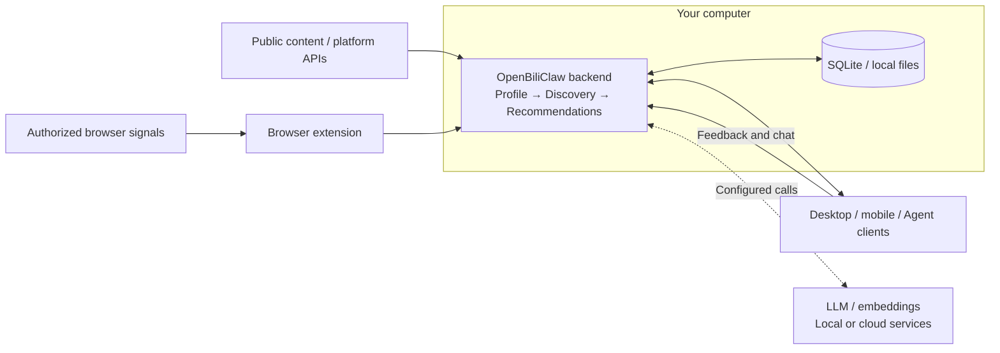

# 🦀 OpenBiliClaw

**Less repetitive scrolling. More discoveries that fit you.**

An **AI content companion** that listens to your preferences, remembers your interests, and searches across platforms for you. 
It runs on your computer and uses a profile you can inspect and correct to guide discovery and recommendations.

[**Why use it**](#why-openbiliclaw) · [**What makes it different**](#what-makes-it-different) · [**Product preview**](#product-preview) · [**Get started**](#quick-start) · [Website](https://whiteguo233.github.io/OpenBiliClaw/?lang=en) · [中文](README.md)

## Why OpenBiliClaw?

You open several apps, scroll through plenty of posts, and still find little you want to spend time on. When you want to learn something new, you have to invent search terms, switch platforms, and judge each result yourself.

OpenBiliClaw puts some of that discovery and filtering into an agent that builds an ongoing understanding of your taste—and lets you correct it:

| A problem you might recognize | How OpenBiliClaw approaches it |
|---|---|
| **Plenty to scroll through, plenty left to filter.** A relevant title says little about whether the depth or teaching style suits you. | Use interests, content style, and topics to avoid when evaluating candidates. Read a personal recommendation reason before deciding to open one. |
| **Your interests are scattered across platforms.** Tutorials, practical experiences, and open-source projects live in different places. | Bring signals from connected sources into one profile, then use it to discover videos, articles, posts, and public projects across platforms. |
| **You want something new but don't know what to search for.** Familiar topics keep appearing while unfamiliar finds remain out of reach. | Generate search directions from your profile, follow related content, and explore other fields. Confirm or reject suggested new interests. |
| **A recommendation gets you wrong, and a click doesn't explain why.** Brief curiosity about a topic needn't become a lasting preference. | Inspect and edit your profile, explain preferences in conversation, and use item feedback or topic exclusions to guide future filtering. |

## What makes it different?

### 1. An understanding of you that you can inspect and change

Start with authorized signals such as history, favorites, and follows. Over time, build a profile of **interests, content preferences, topics to avoid, and recent context**. See how the system understands you, edit its assumptions, or add context through conversation.

**Manual corrections are stored separately and survive later AI profile rebuilds.** A trait you remove stays suppressed even if the model infers it again.

This understanding informs search directions, candidate evaluation, and recommendation wording. “Interested in guitar” becomes more useful when it also captures **wanting guided practice, preferring clear explanations, and not wanting gear reviews right now**.

  
   
  An existing repository screenshot from a different UI version than the walkthrough below. Profile descriptions are model inferences you can correct.

### 2. Active discovery across platforms, guided by your taste

While the backend is running, it searches on your configured schedule, follows related content, and explores new directions. Candidates are evaluated against your personal preferences. Choose sources, adjust their proportions, and confirm interests beyond familiar subjects.

Exploration ranges from nearby subjects to connections across fields. When the system proposes an interest, you can **confirm it, reject it, defer it, or discuss it**, helping shape where it searches next.

**You can encounter a creator, project, or topic before you know its name or the right search term.** Bilibili, Xiaohongshu, YouTube, GitHub, and other sources offer different types of content. Discovery, login, and initialization capabilities vary; see [sources and clients](#sources-and-clients).

These controls affect recommendations inside OpenBiliClaw. They do not change the algorithms behind each platform's own home feed.

### 3. Reasons you can judge, feedback you can explain

Recommendations explain their connection to your interests. If one misses, mark it Not interested or discuss the content: is the topic wrong, the style unhelpful, or the timing off? Preferences expressed in conversation are analyzed, and some inferences ask for confirmation. Explicit profile edits and topics to avoid inform subsequent filtering.

Item feedback and lasting preferences are handled separately. Limits on newly confirmed interests and diversity controls help keep one direction from taking over a batch. **Learning and discovery take time; submitting feedback does not guarantee that the next screen changes immediately.**

### 4. Keep control of what you build up

Profiles, recommendations, conversations, and saved content stay on your own backend by default. Choose model services, data sources, and interfaces. Desktop, phone, and extension share that backend, and [Agent Bridge](docs/agent-integration.md) exposes recommendations and profiles to your existing AI assistant.

Self-hosting gives you control over what the system learns, what to correct, and which model to use, while retaining your accumulated data. Cloud model services still receive the content needed for their calls; see [privacy at a glance](#privacy-at-a-glance).

## Where it fits into your day

These are **usage scenarios and example preference statements** explaining existing capabilities. They are not inputs or generated results from the recordings, testimonials, or promised outcomes.

### Develop a hobby with some depth

> “I'm learning guitar. I want beginner lessons I can practice along with, explained slowly and clearly. Skip gear reviews for now.”

Conversation and profile edits capture the learning direction, style, and exclusions for subsequent discovery and evaluation.

### Explore a subject across platforms

> “I'm exploring local AI tools. I want explanations of how they work, plus open-source projects I can actually try.”

Discover different content types from enabled sources, assess recommendation reasons in one place, and save useful finds for later.

### Let recommendations follow a change in interests

> “I'm taking a break from gameplay videos. I'd like more photography, especially explanations of composition.”

Adjust profile interests and exclusions, then refine them with feedback. You can express a new direction without repeated clicks.

**A good fit if:** you often look for content across platforms, have specific preferences, and want recommendations you can inspect and correct. Expect to configure models, keep a backend running, and wait for initialization. Cloud models may incur costs; results depend on the model, source availability, and the signals already collected.

> OpenBiliClaw started with Bilibili, which is where “Bili” comes from. It now works across content platforms, with model services and sources that you choose.

## Product preview

Start with an existing recommendation: **expand its explanation → save to Watch later → confirm it in the Content library**.

  

[**Watch the full recording (25 s, Chinese / English captions)**](https://whiteguo233.github.io/OpenBiliClaw/?lang=en#demo) · [Transcript and recording notes](docs/media/README.md)

Recorded against the real backend, showing existing recommendations and a local save. Profile learning, cross-platform discovery, and recommendation generation are not recorded here. The UI is in Chinese; English captions explain the actions. Recording scope and content sources are documented in the notes.

Mobile Web recording: like feedback and the shared library

Tap Like in Mobile Web and confirm the feedback is accepted, then open the same backend's Content library to see items saved from the desktop.

  

[Watch the mobile recording (about 20 s)](https://whiteguo233.github.io/OpenBiliClaw/?lang=en#mobile-demo) · [Transcript and recording notes](docs/media/README.md)

More recorded screenshots: explanations, library, and Mobile Web

**Desktop recommendations** — Content from different sources with a reason for each recommendation.

  

**Expand an explanation** — Read why a piece of content was recommended.

  

**Content library** — Find the saved item under Watch later.

  

**Mobile Web** — View recommendations in the phone layout, connected to the same backend.

  

Click a screenshot to view it at full size. The phone image shows Mobile Web; see the client list below for the native Flutter app.

## Quick Start

**You need a computer to run the backend, a working LLM service, an independent embedding service, and at least one source that can return profile signals.** Local Ollama `bge-m3` is the default embedding option. Cloud LLM usage is billed by your chosen provider.

1. **Install the desktop backend.** Download the macOS `.dmg` or Windows `.exe` from [Latest Release](https://github.com/whiteguo233/OpenBiliClaw/releases/latest), install, and launch it. The lean package downloads `bge-m3` on first launch; `-with-embedding` includes the ~1.1GB embedding model. **Both still need a separately configured LLM.** Desktop packages are experimental pre-releases; see the [installation guide](docs/installation.en.md#desktop) for first-launch issues.
2. **Install the browser extension.** Use the [Chrome Web Store](https://chromewebstore.google.com/detail/cdfjfkdjjhdaccbldipkjhpibnfbiamg) or a release package. The extension handles platform sessions and browser interaction. Firefox, Safari, and manual loading are covered in the [full installation guide](docs/installation.en.md).
3. **Configure models and sources.** Open `http://127.0.0.1:8420/setup/`, configure your LLM, and check embeddings. Sign in to Bilibili in the extension browser or select another source in the wizard. Choose only the sources you want to use for profile initialization.
4. **Initialize and explore.** Once connections are ready, start initialization and wait for the first profile and discovery cycle. Open `http://127.0.0.1:8420/web`, read a recommendation's explanation, and give feedback to guide the next ones.

Keep the backend running. When your phone and computer share a LAN, scan the extension's QR code to open Mobile Web and add it to your home screen.

### Setup Details

The [full installation guide](docs/installation.en.md) covers platforms, updates, and troubleshooting. Choose the route that fits:

| Your setup | Start here |
|---|---|
| An AI agent will install or customize the source | [AI one-line deployment](docs/installation.en.md#ai-deploy) |
| Linux / WSL2 / terminal installation | [Bash / PowerShell scripts](docs/installation.en.md#script-install) |
| Existing Docker environment | [Docker](docs/installation.en.md#docker) |
| Development and debugging | [Manual installation](docs/installation.en.md#manual) |
| Mobile access away from your LAN or a remote browser | [Embedded Tailnet](docs/modules/tailnet.md) · [HTTPS](docs/https-deployment.md) |
| Mainland China downloads | [v0.3.221 archive and version notes](docs/installation.en.md#desktop); GitHub Releases are authoritative |

## Sources and clients

Bilibili is enabled by default; enable other sources explicitly in settings. Discovery, login, and initialization support differ by source:

| Source | What to know |
|---|---|
| Bilibili | Start from history, favorites, and follows; discover through search, trends, and related content |
| Xiaohongshu, Douyin, YouTube | The extension reads authorized signals; YouTube also supports Takeout imports |
| X, Zhihu, Reddit | Use existing sessions and source-specific adapters; content appears as text cards |
| Linux.do, V2EX, Weibo | Public discovery is available; personal initialization uses browser access as required |
| Bangumi, GitHub | Discover public content anonymously; public usernames can seed profiles from collections / stars |
| Open Web | General webpage extraction and custom sources; see the discovery guide |

For permissions and differences, see [source access and limitations](docs/installation.en.md#source-access) and the [discovery engine](docs/modules/discovery.md).

| Client | Where it fits |
|---|---|
| Browser extension | Browse within platforms, sync sessions, give feedback, and chat; Chromium, Firefox, macOS Safari |
| Desktop Web `/web` | Recommendations, profile, library, and settings on a large screen |
| Mobile Web `/m/` | Scan a QR code and add it to your phone's home screen |
| [Flutter client](https://github.com/whiteguo233/OpenBiliClaw-mobile) | Android / iOS / Web / desktop preview; iOS requires re-signing with your own account |
| [DSH plugin](https://github.com/whiteguo233/dsh-openbiliclaw) | Recommendations and Agent Bridge tools inside DeepSeek Harness |

These clients connect to the same backend. Phones do not replace the computer running discovery; browser session sync still belongs to the extension.

## Architecture Overview

This is a conceptual view of the core data flow. For modules, tasks, and processes, see the [architecture overview](docs/architecture-overview.en.md).

## Privacy at a glance

Profiles, recommendation history, chat, and configuration stay on your computer by default. The extension sends data to your configured OpenBiliClaw backend, not to a server operated by the project developers.

**Running locally does not make every call offline: when you choose a cloud LLM or embedding service, necessary profile, chat, or content data is sent to that provider according to your configuration.** Sources also handle sessions under their own contracts; Linux.do, for example, sends a login boolean without uploading cookie values.

Periodic account re-pulls are off by default and can be enabled in settings. You control models, sources, collection, and local data. Exported `.obcbackup` files may contain API keys, cookies, profiles, and history and are not encrypted; transfer them only between trusted devices. See the [privacy policy](docs/privacy.md) for the full boundaries.

## Documentation and integrations

| Looking for | Start here |
|---|---|
| Install, connect, or update | [Installation guide](docs/installation.en.md) · [FAQ](docs/faq.md) |
| All documentation | [Docs index](docs/index.md) |
| How it works | [Architecture](docs/architecture.md) · [Memory design](docs/memory-design.md) |
| Recommendations and profiles | [Discovery engine](docs/modules/discovery.md) · [Soul engine](docs/modules/soul.md) |
| Configuration and commands | [Configuration](docs/modules/config.md) · [CLI reference](docs/modules/cli.md) |
| Plans and contributions | [Specification](docs/spec.md) · [Development guide](docs/contributing.md) |

OpenClaw, Hermes, WorkBuddy, Claude Code, Codex CLI, Cursor, and other hosts that support workspace skills or local JSON CLI can use the [Agent Bridge](docs/agent-integration.md) to read recommendations, chat, and submit feedback. The repo includes an [adapter skill](skills/openbiliclaw-adapter/SKILL.md). External save synchronization requires explicit authorization.

Native clients live in [OpenBiliClaw-mobile](https://github.com/whiteguo233/OpenBiliClaw-mobile). For DeepSeek Harness, see [dsh-openbiliclaw](https://github.com/whiteguo233/dsh-openbiliclaw) / the [DSH plugin directory](https://dshfind.com/zh/plugins).

## Recent Updates

📌 Latest: **v0.3.224 (2026-09-19)**

- **Customize AI reply style**: add a tone instruction for chat, recommendation copy, and profiles, or replace the chat tone entirely.
- **Edit and test in settings**: Desktop Web and the extension can save your reply style and immediately preview a real response without restarting.

Full changelog: [docs/changelog.md](docs/changelog.md).

## Community

Check the [FAQ](docs/faq.md) or open an [issue](https://github.com/whiteguo233/OpenBiliClaw/issues) for help. Share your experience in the [Linux.do discussion](https://linux.do/t/topic/1978894).

<table>
  <tr>
    <td align="center" width="50%">
       
      <b>QQ user group</b>
    </td>
    <td align="center" width="50%">
       
      <a href="https://discord.gg/PU6Xgch8yg"><b>Join Discord</b></a>
    </td>
  </tr>
</table>

Source mirrors: [Gitee](https://gitee.com/whiteguo233/OpenBiliClaw) · [AtomGit](https://atomgit.com/whiteguo233/OpenBiliClaw). Download mirrors may lag; use GitHub Releases as the version reference.

## Contributing and acknowledgements

Help improve source adapters, recommendations, documentation, or tests. Read the [development guide](docs/contributing.md) first, and develop and validate changes in a dedicated worktree.

Thanks to these contributors and their improvements

- Thanks to [@addtion99](https://github.com/addtion99) for proposing configurable browser-extension backend host / port settings and sharing the popup-side implementation idea in [#8](https://github.com/whiteguo233/OpenBiliClaw/pull/8).
- Thanks to [@jiaobenhaimo](https://github.com/jiaobenhaimo) for contributing Safari extension, watch-later bookmarks, YouTube repost detection, and marketing filter designs in [#53](https://github.com/whiteguo233/OpenBiliClaw/pull/53). The OR-join dedup fix and watch-later feature have been merged into main.
- Thanks to [@tangle111-design](https://github.com/tangle111-design) for exploring `style_key` viewing modes, recommendation tone, Bilibili initialization, and LLM / profile workflow improvements in [#69](https://github.com/whiteguo233/OpenBiliClaw/pull/69). The relevant ideas have been reviewed, split up, and selectively merged into main.
- Thanks to [@DongLanQwQ0](https://github.com/DongLanQwQ0) for polishing desktop web interactions — side-drawer collapse animation, a delight-card drag dead zone, and a stacked toast notification system — in [#102](https://github.com/whiteguo233/OpenBiliClaw/pull/102). Merged into main.
- Thanks to [@DongLanQwQ0](https://github.com/DongLanQwQ0) for the desktop web theme-engine rework to oklch in [#110](https://github.com/whiteguo233/OpenBiliClaw/pull/110) — a single `--hue-primary` control point with a 12-hue tunable color picker, a five-step accent ramp, and unified interaction states. Merged into main.
- Thanks to [@wuwafly3](https://github.com/wuwafly3) for continued work on multimodal recommendations: [#100](https://github.com/whiteguo233/OpenBiliClaw/pull/100) introduced the DashScope (Alibaba Model Studio) multimodal embedding provider and image-only cover vectors, while [#135](https://github.com/whiteguo233/OpenBiliClaw/pull/135) added the user visual profile (P1), Bilibili danmaku semantics (P2), video keyframes (P3), and cross-platform visual weighting pipeline. Mainline follow-up hardened the contracts and retry behavior, added configuration surfaces, and completed real-environment validation.
- Thanks to [@LHMQ878](https://github.com/LHMQ878) for fixing the `agent_bootstrap` TOML instance-section matching in [#182](https://github.com/whiteguo233/OpenBiliClaw/pull/182): quoted section headers such as `[llm.instances."openai"]` are now treated as the same table as bare keys, preventing duplicate table declarations and `tomllib` failures when bootstrap is run again. Merged into main.
- Thanks to [@Patrick5D](https://github.com/Patrick5D) for the event source-attribution persistence in [#179](https://github.com/whiteguo233/OpenBiliClaw/pull/179): top-level `events.source_platform` / `content_id` / `source_confidence` columns, the unified source-resolution priority, and the schema v6 incremental migration — the data foundation for platform-scoped data revocation and profile rebuild. Mainline added follow-up hardening for unknown platform slugs and confidence-evidence enforcement. Merged into main.
- Thanks to [@OctoBored](https://github.com/OctoBored) for restoring the live Star History chart in the Chinese and English READMEs in [#196](https://github.com/whiteguo233/OpenBiliClaw/pull/196), replacing the dead badge and temporary notice; mainline also escaped the URL ampersands during merge. Merged into main.

## License

[MIT](LICENSE)
