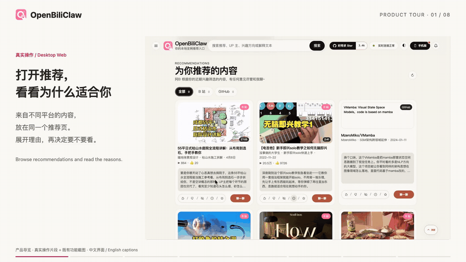
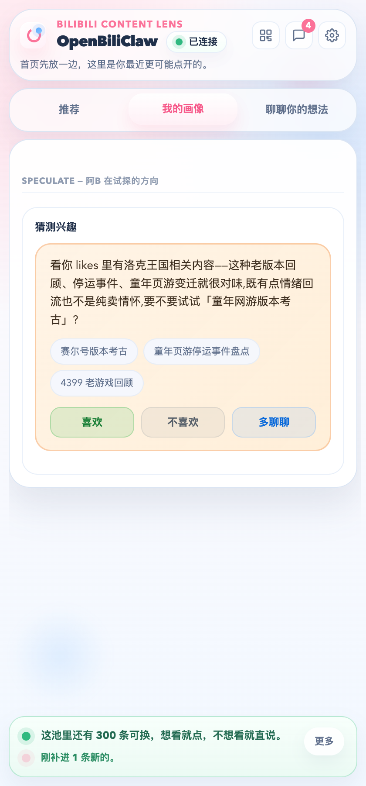
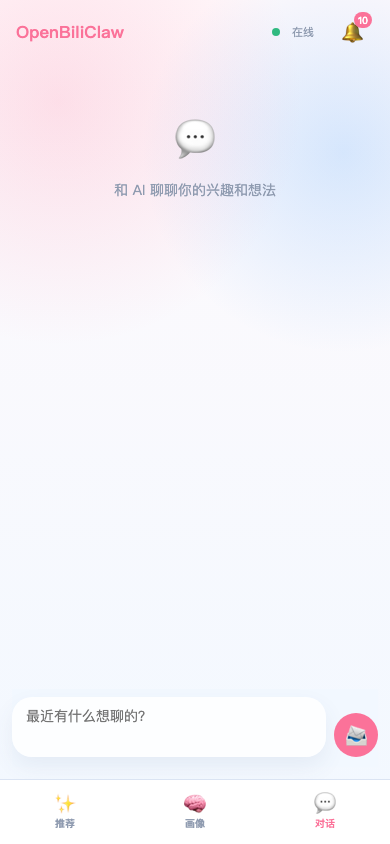
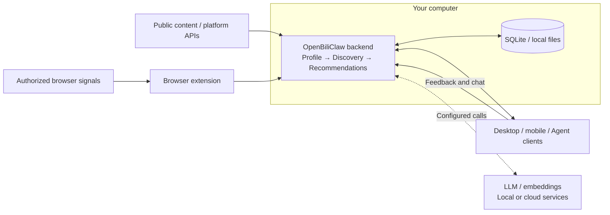

# 🦀 OpenBiliClaw

**A general-purpose personalized content recommendation agent—runs locally, understands you across platforms, built for you alone.**

It keeps learning from your cross-platform activity, feedback, and conversations, then actively finds content you may love—including interests you have not thought of yet.

[**See it in action**](#product-preview) · [**Get started**](#quick-start) · [**Why OpenBiliClaw**](#why-openbiliclaw) · [Website](https://whiteguo233.github.io/OpenBiliClaw/?lang=en) · [中文](README.md)

## Product preview

**See the product first: browse recommendations → read reasons and give feedback → continue in the extension and on your phone → explore profiles, new interests, and conversation.**

  

[**Watch the full product tour (70 s, Chinese / English captions)**](https://whiteguo233.github.io/OpenBiliClaw/?lang=en#demo) · [Transcript and media notes](docs/media/README.md)

The 20-second GIF previews eight chapters. The full tour combines **real interaction recordings and previously published feature screenshots**, with an introduction to each section. Desktop, extension, and phone browsing, saves, and feedback use a real local backend. Profile and chat sections show existing interfaces; the video does not demonstrate new profile learning or recommendation generation.

### Browse on desktop, in your browser, or on your phone

**Desktop Web:** Browse content from different platforms on a large screen, expand recommendation reasons, tap Like or Not interested, save to your library, or start a conversation about an item.

  

[Full desktop recording: expand a reason → Watch later → confirm in the library (25 s)](docs/media/recommendation-walkthrough.mp4)

<table>
  <tr>
    <td align="center" width="50%" valign="top">
       
      <b>Browser extension</b> 
      Open recommendations in your browser, give feedback, save, and chat. Connect authorized platform sessions. 
      <a href="docs/media/extension-walkthrough.mp4">Extension recording: browse across platforms → library (18 s)</a>
    </td>
    <td align="center" width="50%" valign="top">
       
      <b>Mobile Web</b> 
      Scan to connect to the same backend. Browse, give feedback, and pick up content saved on your desktop. 
      <a href="https://whiteguo233.github.io/OpenBiliClaw/?lang=en#mobile-demo">Mobile recording: like feedback and shared library (about 20 s)</a>
    </td>
  </tr>
</table>

The extension recording opens the actual extension page in its own tab for clarity. Phone screenshots show Mobile Web. A [native Flutter client](https://github.com/whiteguo233/OpenBiliClaw-mobile) and [DeepSeek Harness plugin](https://github.com/whiteguo233/dsh-openbiliclaw) also connect to the same backend; see [client details below](#sources-and-clients).

### See how it understands you—and talk to it

Beyond the feed, explore the agent's understanding of you, your content preferences, and possible new interests. Start a conversation about a recommendation. Click any image to view it at full size.

<table>
  <tr>
    <td align="center" width="50%" valign="top">
       
      <b>Personal profile</b> 
      See how it interprets your interests, traits, and deeper needs, and correct its assumptions.
    </td>
    <td align="center" width="50%" valign="top">
       
      <b>Cognitive style and taste</b> 
      Capture preferred explanations, depth, and presentation alongside topics and longer-term values.
    </td>
  </tr>
  <tr>
    <td align="center" width="50%" valign="top">
       
      <b>Interest probes</b> 
      Discover suggested new directions, read the connection, then confirm, reject, or discuss them.
    </td>
    <td align="center" width="50%" valign="top">
       
      <b>Continue the conversation</b> 
      Explain what appeals to you, why something misses, or explore a new topic together.
    </td>
  </tr>
</table>

These are existing repository screenshots from an earlier UI version than the recordings above. Profiles are model inferences; manual corrections are preserved during later AI rebuilds. More views: [desktop profile](docs/images/desktop-profile.png) · [values and interests](docs/images/screenshot-profile-values.png) · [recorded Content library](docs/images/live-desktop-library.jpg).

## Quick Start

**You need a computer to run the backend, a working LLM service, an independent embedding service, and at least one source that can return profile signals.** Local Ollama `bge-m3` is the default embedding option. Cloud LLM usage is billed by your chosen provider.

1. **Install the desktop backend.** Download the macOS `.dmg` or Windows `.exe` from [Latest Release](https://github.com/whiteguo233/OpenBiliClaw/releases/latest), install, and launch it. The lean package downloads `bge-m3` on first launch; `-with-embedding` includes the ~1.1GB embedding model. **Both still need a separately configured LLM.** Desktop packages are experimental pre-releases; see the [installation guide](docs/installation.en.md#desktop) for first-launch issues.
2. **Install the browser extension.** Use the [Chrome Web Store](https://chromewebstore.google.com/detail/cdfjfkdjjhdaccbldipkjhpibnfbiamg) or a release package. The extension handles platform sessions and browser interaction. Firefox, Safari, and manual loading are covered in the [full installation guide](docs/installation.en.md).
3. **Configure models and sources.** Open `http://127.0.0.1:8420/setup/`, configure your LLM, and check embeddings. Sign in to Bilibili in the extension browser or select another source in the wizard. Choose only the sources you want to use for profile initialization.
4. **Initialize and explore.** Once connections are ready, start initialization and wait for the first profile and discovery cycle. Open `http://127.0.0.1:8420/web`, read a recommendation's explanation, and give feedback to guide the next ones.

Keep the backend running. When your phone and computer share a LAN, scan the extension's QR code to open Mobile Web and add it to your home screen.

### Setup Details

The [full installation guide](docs/installation.en.md) covers platforms, updates, and troubleshooting. Choose the route that fits:

| Your setup | Start here |
|---|---|
| An AI agent will install or customize the source | [AI one-line deployment](docs/installation.en.md#ai-deploy) |
| Linux / WSL2 / terminal installation | [Bash / PowerShell scripts](docs/installation.en.md#script-install) |
| Existing Docker environment | [Docker](docs/installation.en.md#docker) |
| Development and debugging | [Manual installation](docs/installation.en.md#manual) |
| Mobile access away from your LAN or a remote browser | [Embedded Tailnet](docs/modules/tailnet.md) · [HTTPS](docs/https-deployment.md) |
| Mainland China downloads | [v0.3.221 archive and version notes](docs/installation.en.md#desktop); GitHub Releases are authoritative |

## Why OpenBiliClaw?

Recommendation systems connect people with content while balancing platform goals such as retention, creator ecosystems, and revenue. **The platform usually decides how those goals are weighted.** Meanwhile, your interests are scattered across services, with no single feed starting from your whole perspective.

OpenBiliClaw aims to put recommendations on your side: **understand you first, then actively find content with that understanding—an agent built for one person: you.**

- **Understand you before searching.** Authorized activity, feedback, and conversation gradually inform interests, cognitive style, values, and deeper needs. Five memory layers connect events, preferences, awareness, insights, and the personal profile. Profile descriptions are model inferences you can inspect and correct.
- **Explore interests you have not thought of yet.** Propose connections across fields, then use actual content and feedback to test them. Mechanical watches leading to architectural aesthetics, or quantum physics to philosophy, illustrate the kind of connection it seeks. Confirm, reject, or defer suggested interests.
- **Keep evolving through use.** Activity and feedback feed memory; memory deepens the profile; the profile guides discovery; recommendations and conversation bring new understanding. While the backend runs, the cycle continues on your configured schedule. Learning and discovery take time.
- **Search across platforms; keep what you build.** Bring signals from multiple sources into one profile and search beyond any single platform. Profiles, recommendations, conversations, and saved content stay on your own backend by default. Choose models and sources, move your data, or customize the code. See [privacy at a glance](#privacy-at-a-glance) for cloud-model boundaries.

> OpenBiliClaw started with Bilibili, which is where “Bili” comes from. It now works across content platforms. These capabilities guide OpenBiliClaw's own recommendations; they do not modify the algorithms behind other platforms' home feeds.

## Sources and clients

Bilibili is enabled by default; enable other sources explicitly in settings. Discovery, login, and initialization support differ by source:

| Source | What to know |
|---|---|
| Bilibili | Start from history, favorites, and follows; discover through search, trends, and related content |
| Xiaohongshu, Douyin, YouTube | The extension reads authorized signals; YouTube also supports Takeout imports |
| X, Zhihu, Reddit | Use existing sessions and source-specific adapters; content appears as text cards |
| Linux.do, V2EX, Weibo | Public discovery is available; personal initialization uses browser access as required |
| Bangumi, GitHub | Discover public content anonymously; public usernames can seed profiles from collections / stars |
| Open Web | General webpage extraction and custom sources; see the discovery guide |

For permissions and differences, see [source access and limitations](docs/installation.en.md#source-access) and the [discovery engine](docs/modules/discovery.md).

| Client | Where it fits |
|---|---|
| Browser extension | Browse within platforms, sync sessions, give feedback, and chat; Chromium, Firefox, macOS Safari |
| Desktop Web `/web` | Recommendations, profile, library, and settings on a large screen |
| Mobile Web `/m/` | Scan a QR code and add it to your phone's home screen |
| [Flutter client](https://github.com/whiteguo233/OpenBiliClaw-mobile) | Android / iOS / Web / desktop preview; iOS requires re-signing with your own account |
| [DSH plugin](https://github.com/whiteguo233/dsh-openbiliclaw) | Recommendations and Agent Bridge tools inside DeepSeek Harness |

These clients connect to the same backend. Phones do not replace the computer running discovery; browser session sync still belongs to the extension.

## Architecture Overview

This is a conceptual view of the core data flow. For modules, tasks, and processes, see the [architecture overview](docs/architecture-overview.en.md).

## Privacy at a glance

Profiles, recommendation history, chat, and configuration stay on your computer by default. The extension sends data to your configured OpenBiliClaw backend, not to a server operated by the project developers.

**Running locally does not make every call offline: when you choose a cloud LLM or embedding service, necessary profile, chat, or content data is sent to that provider according to your configuration.** Sources also handle sessions under their own contracts; Linux.do, for example, sends a login boolean without uploading cookie values.

Periodic account re-pulls are off by default and can be enabled in settings. You control models, sources, collection, and local data. Exported `.obcbackup` files may contain API keys, cookies, profiles, and history and are not encrypted; transfer them only between trusted devices. See the [privacy policy](docs/privacy.md) for the full boundaries.

## Documentation and integrations

| Looking for | Start here |
|---|---|
| Install, connect, or update | [Installation guide](docs/installation.en.md) · [FAQ](docs/faq.md) |
| All documentation | [Docs index](docs/index.md) |
| How it works | [Architecture](docs/architecture.md) · [Memory design](docs/memory-design.md) |
| Recommendations and profiles | [Discovery engine](docs/modules/discovery.md) · [Soul engine](docs/modules/soul.md) |
| Configuration and commands | [Configuration](docs/modules/config.md) · [CLI reference](docs/modules/cli.md) |
| Plans and contributions | [Specification](docs/spec.md) · [Development guide](docs/contributing.md) |

OpenClaw, Hermes, WorkBuddy, Claude Code, Codex CLI, Cursor, and other hosts that support workspace skills or local JSON CLI can use the [Agent Bridge](docs/agent-integration.md) to read recommendations, chat, and submit feedback. The repo includes an [adapter skill](skills/openbiliclaw-adapter/SKILL.md). External save synchronization requires explicit authorization.

Native clients live in [OpenBiliClaw-mobile](https://github.com/whiteguo233/OpenBiliClaw-mobile). For DeepSeek Harness, see [dsh-openbiliclaw](https://github.com/whiteguo233/dsh-openbiliclaw) / the [DSH plugin directory](https://dshfind.com/zh/plugins).

## Recent Updates

📌 Latest: **v0.3.224 (2026-09-19)**

- **Customize AI reply style**: add a tone instruction for chat, recommendation copy, and profiles, or replace the chat tone entirely.
- **Edit and test in settings**: Desktop Web and the extension can save your reply style and immediately preview a real response without restarting.

Full changelog: [docs/changelog.md](docs/changelog.md).

## Community

Check the [FAQ](docs/faq.md) or open an [issue](https://github.com/whiteguo233/OpenBiliClaw/issues) for help. Share your experience in the [Linux.do discussion](https://linux.do/t/topic/1978894).

<table>
  <tr>
    <td align="center" width="50%">
       
      <b>QQ user group</b>
    </td>
    <td align="center" width="50%">
       
      <a href="https://discord.gg/PU6Xgch8yg"><b>Join Discord</b></a>
    </td>
  </tr>
</table>

Source mirrors: [Gitee](https://gitee.com/whiteguo233/OpenBiliClaw) · [AtomGit](https://atomgit.com/whiteguo233/OpenBiliClaw). Download mirrors may lag; use GitHub Releases as the version reference.

## Contributing and acknowledgements

Help improve source adapters, recommendations, documentation, or tests. Read the [development guide](docs/contributing.md) first, and develop and validate changes in a dedicated worktree.

Thanks to these contributors and their improvements

- Thanks to [@addtion99](https://github.com/addtion99) for proposing configurable browser-extension backend host / port settings and sharing the popup-side implementation idea in [#8](https://github.com/whiteguo233/OpenBiliClaw/pull/8).
- Thanks to [@jiaobenhaimo](https://github.com/jiaobenhaimo) for contributing Safari extension, watch-later bookmarks, YouTube repost detection, and marketing filter designs in [#53](https://github.com/whiteguo233/OpenBiliClaw/pull/53). The OR-join dedup fix and watch-later feature have been merged into main.
- Thanks to [@tangle111-design](https://github.com/tangle111-design) for exploring `style_key` viewing modes, recommendation tone, Bilibili initialization, and LLM / profile workflow improvements in [#69](https://github.com/whiteguo233/OpenBiliClaw/pull/69). The relevant ideas have been reviewed, split up, and selectively merged into main.
- Thanks to [@DongLanQwQ0](https://github.com/DongLanQwQ0) for polishing desktop web interactions — side-drawer collapse animation, a delight-card drag dead zone, and a stacked toast notification system — in [#102](https://github.com/whiteguo233/OpenBiliClaw/pull/102). Merged into main.
- Thanks to [@DongLanQwQ0](https://github.com/DongLanQwQ0) for the desktop web theme-engine rework to oklch in [#110](https://github.com/whiteguo233/OpenBiliClaw/pull/110) — a single `--hue-primary` control point with a 12-hue tunable color picker, a five-step accent ramp, and unified interaction states. Merged into main.
- Thanks to [@wuwafly3](https://github.com/wuwafly3) for continued work on multimodal recommendations: [#100](https://github.com/whiteguo233/OpenBiliClaw/pull/100) introduced the DashScope (Alibaba Model Studio) multimodal embedding provider and image-only cover vectors, while [#135](https://github.com/whiteguo233/OpenBiliClaw/pull/135) added the user visual profile (P1), Bilibili danmaku semantics (P2), video keyframes (P3), and cross-platform visual weighting pipeline. Mainline follow-up hardened the contracts and retry behavior, added configuration surfaces, and completed real-environment validation.
- Thanks to [@LHMQ878](https://github.com/LHMQ878) for fixing the `agent_bootstrap` TOML instance-section matching in [#182](https://github.com/whiteguo233/OpenBiliClaw/pull/182): quoted section headers such as `[llm.instances."openai"]` are now treated as the same table as bare keys, preventing duplicate table declarations and `tomllib` failures when bootstrap is run again. Merged into main.
- Thanks to [@Patrick5D](https://github.com/Patrick5D) for the event source-attribution persistence in [#179](https://github.com/whiteguo233/OpenBiliClaw/pull/179): top-level `events.source_platform` / `content_id` / `source_confidence` columns, the unified source-resolution priority, and the schema v6 incremental migration — the data foundation for platform-scoped data revocation and profile rebuild. Mainline added follow-up hardening for unknown platform slugs and confidence-evidence enforcement. Merged into main.
- Thanks to [@OctoBored](https://github.com/OctoBored) for restoring the live Star History chart in the Chinese and English READMEs in [#196](https://github.com/whiteguo233/OpenBiliClaw/pull/196), replacing the dead badge and temporary notice; mainline also escaped the URL ampersands during merge. Merged into main.

## License

[MIT](LICENSE)
